inhttps://app.lesson-organizer.de/

## 1. Neue Stunde anlegen

- Klicke auf „**Stunde erstellen**“.
- Gib die **Eckdaten** ein:
  - Wähle einen passenden **Stundentitel**.
  - Schulform und Jahrgangsstufe auswählen.
  - Fach und passende **Kompetenz** aus dem Lehrplan wählen.
  - Nutze hierfür ggf. die Stichwortsuche.
  - Wähle ggf. auch allg. Bildungs- und Erziehungsziele, sowie Kompetenzen aus den Bildungsstandards aus.

- Klicke auf **„Erstellen“**, um in den Unterrichtsdesigner zu gelangen.

## 2. Überblick über den Unterrichtsdesigner (Sidebar)

- In der linken Seitenleiste findest du:
  - Die gewählte **Kompetenzerwartung**.
  - Felder für **Stundenziele**, **Ideensammlung**, **Dateien** und **Anmerkungen**.

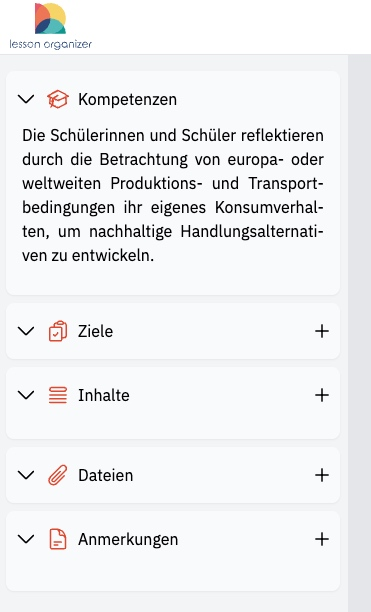

## 3. Ziele definieren

- Nutze ggf. die **Operatoren** für die Formulierung der Lernziele nach den sechs Taxonomiestufen von Bloom.
- Tippe Lernziele manuell ein, oder klicke auf **„Automatisch erstellen“** für Vorschläge von der KI (beta).
- 

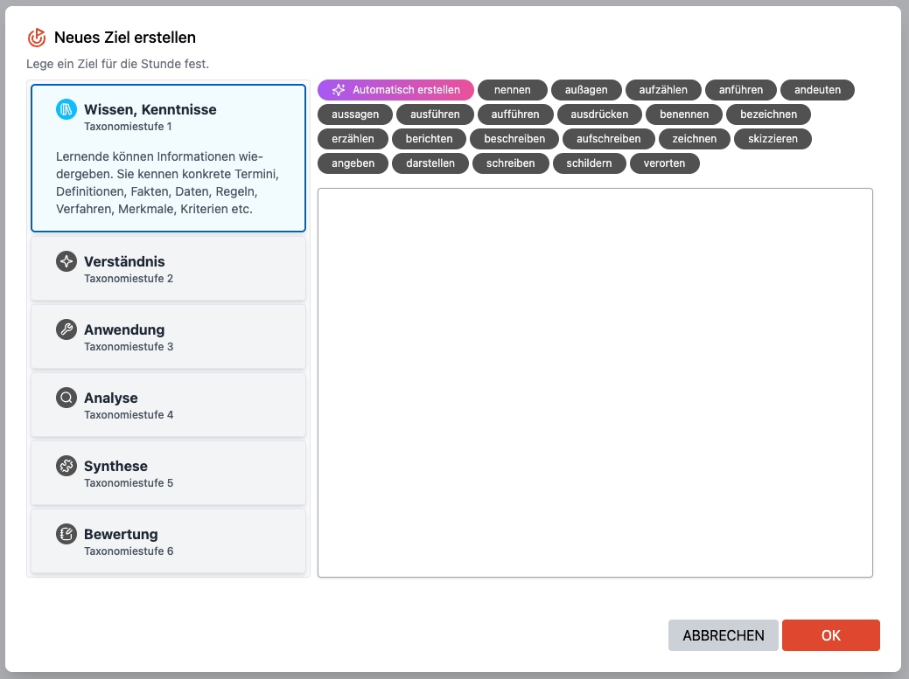

## 4. Erste Inhalte festhalten

- Unter **„Inhalte“** kannst du Ideen notieren oder Bilder/Videos hinzufügen, die du vielleicht später in der Stunde nutzt.
- Du kannst mehrere Felder untereinander erstellen und sie flexibel verschieben.

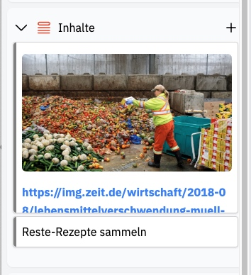

## 5. Phasenspalten anlegen

- Klicke rechts unten auf das **rote Plus**, um die **Phasenspalten** deiner Stunde anzulegen.
- **Eigene Phasen** kannst du mit Klick auf **"+ Neue Phase"** neu erstellen.

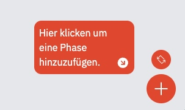

## 6. Inhalte hinzufügen (Videos, Screenshots, Texte)

- Klicke in der Phasenspalte auf das **graue Plus**, um zum Text-Editor zu kommen.

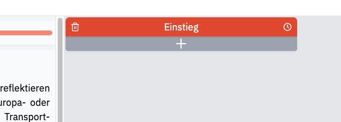

- Gib hier den Inhalt/Ablauf der Phase ein.

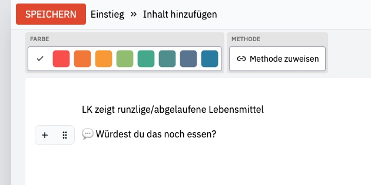

## 7. Unterrichtsmethoden auswählen

- Öffne im Text-Editor den **Methodenkatalog** mit Klick auf "Methode zuweisen".

  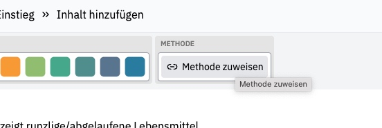
- Suche eine geeignete **Methode** aus, oder lege dir mit Klick auf das **Plus** eine **neue Methode** an.

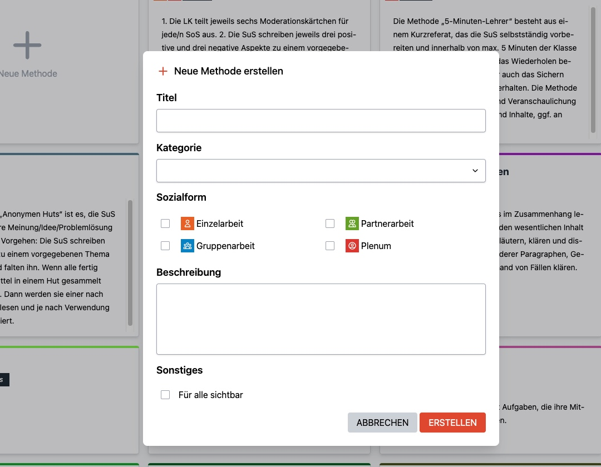

- Um die Suche zu erleichtern: Filtere nach Sozialform, Fach, oder gib ein Stichwort ein.
- Klicke auf "**Speichern**", wenn du fertig bist.

## 8. Phasendauer

- Über die **kleine Uhr**, oben in der Phasenspalte, kannst du die Dauer jeder Phase eingeben.

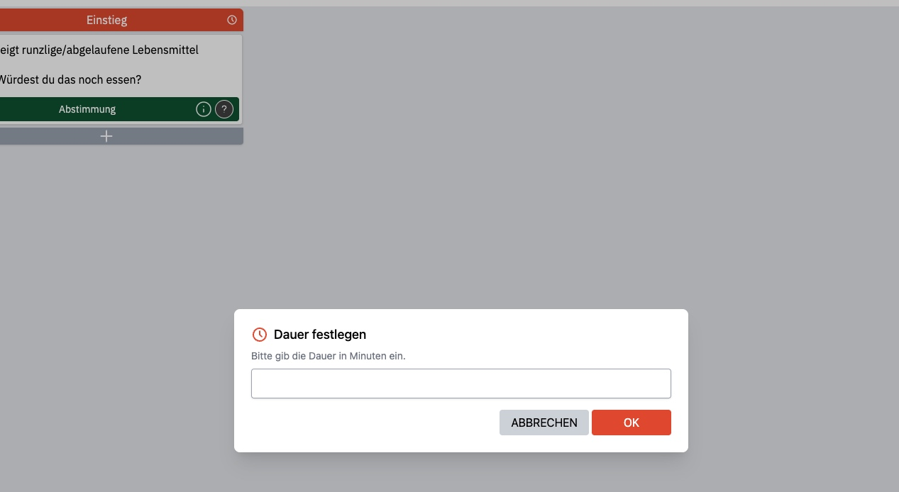

## 9. Gut zu wissen

### TIPPS für den Unterrichtsdesigner

- Du kannst alle Bausteine flexibel per **drag & drop** verschieben. Probiere es einfach aus.
- Wenn du eine Phasenspalte löschst, landen alle Inhalte automatisch links in der Ideensammlung.
- Du kannst **mehrere Inhaltsbausteine** in eine Phasenspalte einfügen.
- **Ansicht umkehren**: Klicke rechts unten auf die roten Richtungspfeile, um zwischen **horizontaler** und **vertikaler** Darstellung zu wechseln.
- Du kannst das Fenster mit Klick auf das "**X**" einfach verlassen. Die Stunde wird automatisch auf dem Server gespeichert.

### TIPPS für den Text-Editor:

- Tippe `/`, um **Inhaltselemente** oder Vorformatierungen, z.B. für Überschriften, einzufügen.
- Tippe `/` und klicke auf "**Inhalt vorschlagen**", um dir von der KI eine Idee vorschlagen zu lassen (beta).
- Verwende `*` für **Aufzählungen**.
- Du kannst z. B. ein Video/Foto per copy & paste einfügen.
- Verlinke **Quellen** direkt im Text (Text markieren → Klick auf das Kettensymbol → Linkadresse einfügen).
- Verwende **Farben**, um z.B. zu markieren, was du vorher vorbereiten musst.

## 10. Artikulationsschema drucken

- Mit Klick auf das **Drucken-Symbol** wird automatisch ein Artikulationsschema generiert.

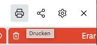

- Gib an wann die Stunde beginnt, dann werden die **Zeitabschnitte** der Phasen automatisch berechnet.

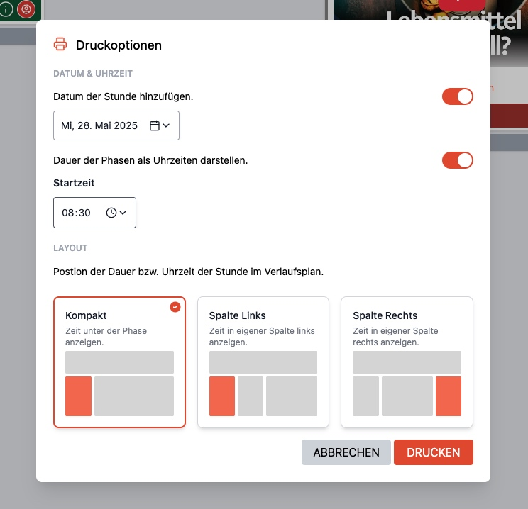

- Wähle ggf. aus, ob du es in **Hoch- oder Querformat** drucken möchtest.

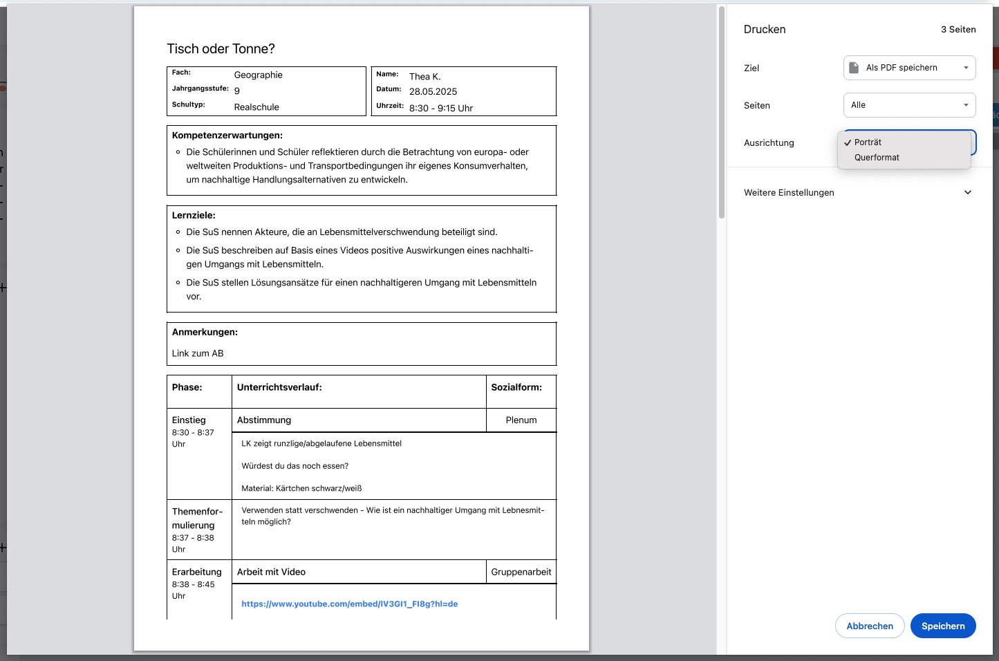

## 11. Stundenbeschreibung hinzufügen

- Klicke auf das **Zahnrad-Symbol**, um eine **automatische Beschreibung** generieren zu lassen, oder tippe selbst eine ein.

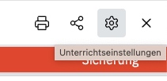

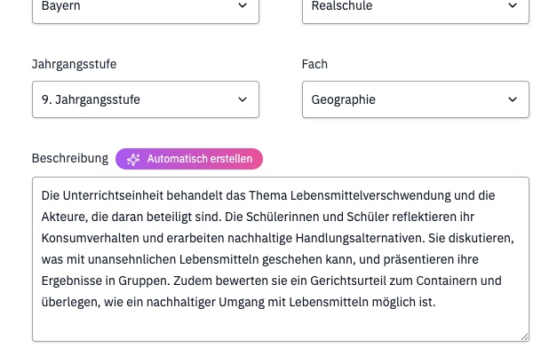

- Speichern nicht vergessen.

## 12. Teilen der Stunde

- Klicke auf das **Teilen-Symbol** im Unterrichtsdesigner oder im Dashboard.

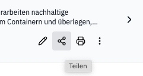

- **Arbeitsgruppe**: Lege zuerst eine neue Arbeitsgruppe an (siehe unten). Wähle dann die entsprechende Arbeitsgruppe aus.
- **Community**: Schiebe den Regler nach rechts und klicke auf "OK".

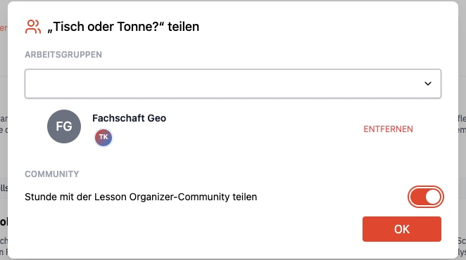

## 13. Arbeitsgruppe anlegen & verwalten

- Lege in der Sidebar im Dashboard mit Klick auf das **„+"** eine neue Arbeitsgruppe an.

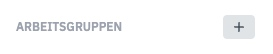

- **Einstellungen**: Füge Mitglieder hinzu und vergib die Rechte.

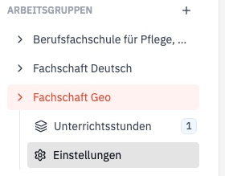

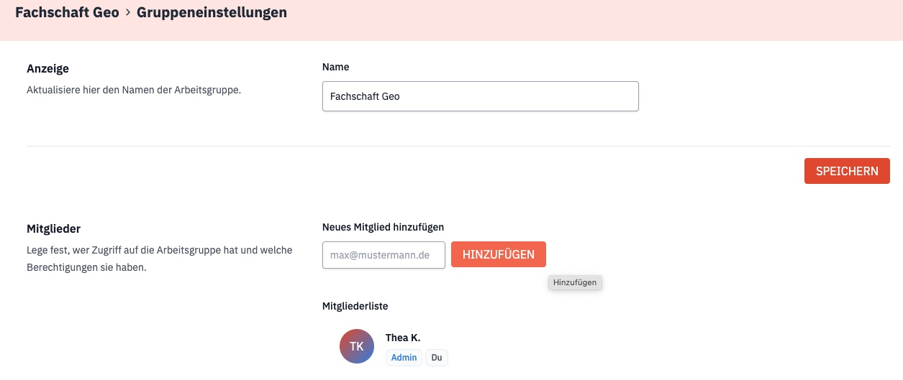

- Als **Admin** kannst du:
  - Mitglieder per E-Mail einladen
  - Rollen (z. B. Admin) vergeben oder entziehen
  - Gruppenname bearbeiten oder Gruppe löschen

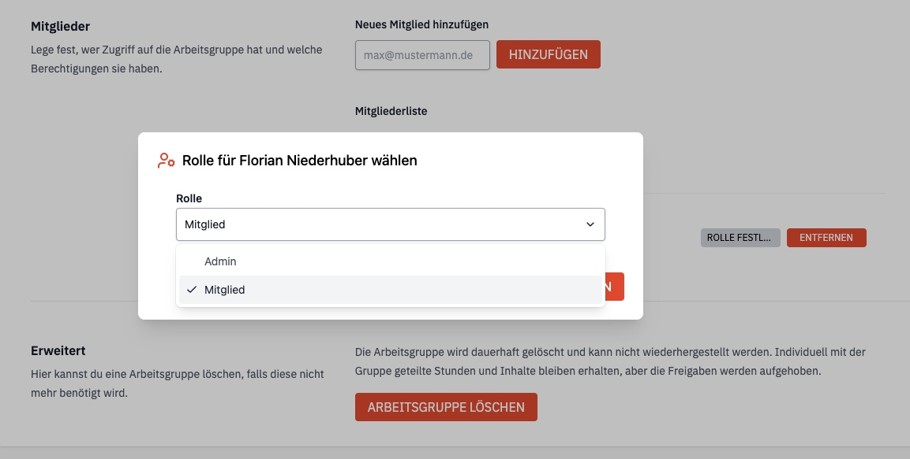

- Um eine Stunde in der Gruppe zu teilen:
  - Öffne das Dashboard oder den Unterrichtsdesigner.
  - Klicke auf das **Teilen-Symbol** → Wähle die Arbeitsgruppe aus.

## 14. Community-Stunden nutzen

- Öffne in der Sidebar im Dashboard die **öffentlichen Stunden**.

  
- Klicke auf das **Drei-Punkte-Menü** und erstelle deine **Kopie** von der Stunde.

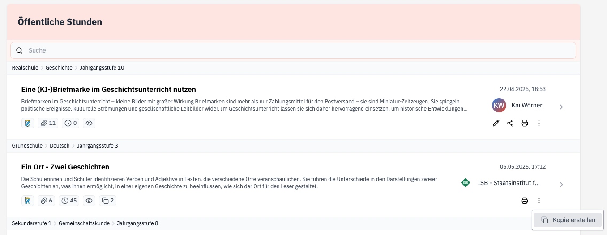

## 15. Bei der Weiterentwicklung mitwirken

Schreib mir deine Fragen, Feedback oder Wünsche jederzeit unter [thea@lesson-organizer.de](mailto:thea@lesson-organizer.de)!

---

### **Viel Spaß beim Planen und Teilen deines Unterrichts!**

#### Lesson Organizer - Planung, die sich gut anfühlt.